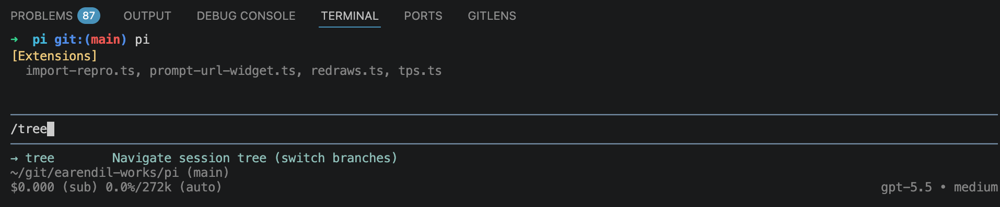
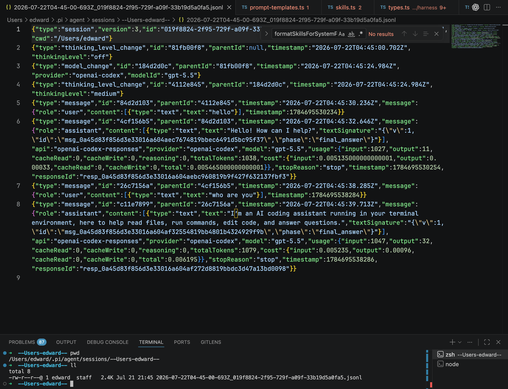

Pi is a minimalist coding agent, but “minimalist” does not mean simplistic. Behind its small default toolset is a useful blueprint for understanding how a production terminal agent works.

In this article, I will walk through Pi from the inside out: the core loop, the context sent to the model, session persistence, tool execution, extensions, prompt assembly, the terminal interface, compaction, and skills. The goal is not only to understand Pi, but also to extract patterns that can be reused when building other agents.


## The Two Main Layers of Pi

The easiest way to understand Pi is to divide it into two conceptual layers.

The first is the **agent core**. It owns the model-facing runtime: conversation state, model streaming, tool calls, tool results, cancellation, and the loop that continues until the model has finished.

The second is **Pi Interactive**, the user-facing coding environment built around that core. It adds the terminal UI, durable sessions, context compaction, project instructions, extensions, skills, commands, and multiple execution modes.

Underneath this two-layer mental model, the TypeScript monorepo separates responsibilities into four packages:

| Package | Responsibility |
| --- | --- |
| `pi-ai` | A common streaming interface over many LLM providers |
| `pi-agent-core` | The stateful agent and tool-calling loop |
| `pi-tui` | Terminal components and differential rendering |
| `pi-coding-agent` | Sessions, prompts, skills, extensions, tools, and user-facing modes |

This separation is important because the TUI is not the agent. The same core can be embedded in another program, exposed through RPC, or used with a completely different interface. Provider-specific behavior also stays below the loop, so changing models does not require rewriting session or UI logic.

## The Core Agent Loop

At the center of Pi is the same feedback loop found in most tool-using agents:

1. Prepare the current context.
2. stream that context to the model.
3. Collect the assistant response.
4. Execute any requested tools.
5. Append the tool results to the conversation.
6. Call the model again.
7. Stop when the model returns a final answer or the run is terminated.

In simplified pseudocode:

```ts
while (true) {
  const assistantMessage = await streamModel(context)
  const toolCalls = findToolCalls(assistantMessage)

  if (toolCalls.length === 0) break

  const results = await executeTools(toolCalls)
  context.messages.push(...results)
}
```

The production implementation is observable through typed events. The event stream describes the agent, turn, message, and tool lifecycles:

```text
agent_start
  turn_start
    message_start -> message_update* -> message_end
    tool_execution_start -> tool_execution_update* -> tool_execution_end
  turn_end
agent_end
```

The loop emits facts without deciding how they should appear. A terminal can render them, a JSON client can serialize them, a session manager can persist them, and a test can assert their order.

There are several details hidden behind the simple loop:

- **Preflight checks:** Pi resolves a tool, validates its arguments, and runs relevant hooks before execution.
- **Parallel execution:** Independent calls can run concurrently, reducing latency when the model requests several reads or searches.
- **Ordered results:** Even if calls finish out of order, results are restored to the model's original call order before entering the conversation.
- **Cancellation:** One abort signal coordinates the model stream, tools, and higher-level operation.
- **Explicit termination:** A tool can indicate that another model call is unnecessary.

Pi also distinguishes **steering** from **follow-up** input. Steering redirects the active run at the next safe boundary. A follow-up waits for the run to settle and then begins another turn. Keeping separate queues makes interactive input predictable.

## Context Initialization

The model does not see the repository or session directly. Before every request, Pi has to construct a context that represents the relevant state.

That context can include:

- the base system prompt;
- global and project-specific instructions;
- tool names, descriptions, and parameter schemas;
- the active path through the session history;
- the current user message and attachments;
- relevant skill instructions;
- context supplied or transformed by extensions.

Pi deliberately keeps its baseline small. Specialized behavior is layered in by the environment rather than permanently baked into one enormous prompt. This makes it easier to identify where a rule came from and to adapt the same agent to different repositories.

Internally, Pi can preserve application-specific message types such as UI notifications, summaries, and extension data. Immediately before a provider request, the `convertToLlm` pipeline projects those rich messages into the narrower user, assistant, and tool-result schema accepted by the model.

This boundary avoids turning an external API format into the schema for the entire application:

```text
Application messages
  -> context transforms
  -> convertToLlm
  -> provider-compatible context
```

## Memory: Sessions and Conversation State

Sessions give the agent continuity. A coding task rarely ends after one response: the agent reads files, forms a hypothesis, edits code, runs a command, inspects the failure, and iterates. Each step depends on what happened before it.

Pi stores sessions as JSON Lines. The format is append-friendly and inspectable, while parent references turn the conversation into a tree rather than a flat transcript.

The tree supports workflows that match real engineering work:

- return to an earlier decision without deleting later messages;
- fork a different implementation from the same point;
- summarize the branch that is no longer active;
- rebuild the current conversation by following parent links.

### Navigating memory with `/tree`

The `/tree` command opens the current session's tree navigator. From there, we can select any earlier entry and continue from that point. Pi does not erase the messages that came after it. The next message simply creates another child from the selected entry, so the old and new continuations become sibling branches in the same session.



*Typing `/tree` opens the session-tree navigator; pressing Escape twice provides a shortcut to the same view.*

Every stored entry has an `id` and a `parentId`. The active conversation is the path from the root to the currently selected leaf. When we move to an older entry and continue, the new record points back to that entry rather than to the previous leaf:

```text
session root
└── user: implement feature
    └── assistant: approach A
        ├── user: continue with A       <- original branch
        └── user: try approach B        <- branch created after /tree
```

Because both paths remain in the same file, `/tree` is useful for exploring alternatives without losing earlier work. When switching away from a branch, Pi can also summarize the path being left and attach that context to the destination. Use `/tree` when alternatives belong to one session; `/fork` or `/clone` is more appropriate when the new path should live in a separate session file.

### Where the JSONL memory is stored

Pi automatically stores sessions below:

```text
~/.pi/agent/sessions/--<working-directory>--/<timestamp>_<uuid>.jsonl
```

The working-directory portion is encoded as a directory name. For example, a session started in `/Users/edward` appears under `~/.pi/agent/sessions/--Users-edward--/`, as shown below.



*The JSONL file is append-friendly: each line is one session entry, including model changes, thinking-level changes, user messages, assistant messages, and usage metadata.*

The screenshot also reveals how the tree is encoded. Each line carries its own `id`; most lines carry the `parentId` of the preceding node on that branch. Following those parent links reconstructs the active history, while entries with the same ancestor represent alternative branches. This is why Pi can navigate a conversation tree while preserving all history in a single JSONL file.

The durable session and the model context are intentionally different objects. The session answers, “What happened?” The context answers, “What does the model need for the next decision?” Keeping them separate lets Pi retain a complete record while showing the model only the active branch and any summaries needed to understand it.

## Tools: How the Agent Acts on the World

The model can produce text and structured requests, but it cannot directly read a file, search a repository, or run a test. Tools are the bridge between the model and the environment.

Pi starts with a deliberately small coding toolset: read, write, edit, and bash. Other capabilities can be added through extensions. Each tool exposes a name, a description, a parameter schema, and an execution function. The schema becomes part of the model's context so that the model knows both what actions are available and how to request them.

### The basic tools in source code

Pi assembles its default set in [`tools/index.ts`](https://github.com/earendil-works/pi/blob/main/packages/coding-agent/src/core/tools/index.ts). Stripped down to the important part, the factory is simply:

```ts
export function createCodingTools(cwd: string): AgentTool[] {
  return [
    createReadTool(cwd),
    createBashTool(cwd),
    createEditTool(cwd),
    createWriteTool(cwd),
  ]
}
```

Each factory returns the same `AgentTool` contract, so the core loop does not need special logic for files versus shell commands. The [`read` tool](https://github.com/earendil-works/pi/blob/main/packages/coding-agent/src/core/tools/read.ts) is a useful example. This adapted excerpt removes image handling, truncation, and TUI rendering to expose its essential shape:

```ts
const readSchema = Type.Object({
  path: Type.String({ description: "File path, relative or absolute" }),
  offset: Type.Optional(Type.Number({ description: "First line, starting at 1" })),
  limit: Type.Optional(Type.Number({ description: "Maximum lines to return" })),
})

function createReadToolDefinition(cwd: string): ToolDefinition {
  return {
    name: "read",
    label: "read",
    description: "Read text files or images, with bounded output.",
    parameters: readSchema,

    async execute(_id, { path, offset, limit }, signal) {
      if (signal?.aborted) throw new Error("Operation aborted")

      const absolutePath = await resolveReadPathAsync(path, cwd)
      const text = await fs.readFile(absolutePath, "utf8")
      const lines = text.split("\n")
      const start = Math.max(0, (offset ?? 1) - 1)
      const selected = lines.slice(start, limit ? start + limit : undefined)

      return {
        content: [{ type: "text", text: selected.join("\n") }],
        details: { totalLines: lines.length },
      }
    },
  }
}

export function createReadTool(cwd: string): AgentTool {
  return wrapToolDefinition(createReadToolDefinition(cwd))
}
```

There are two layers in this example. `ToolDefinition` contains the model-facing schema plus coding-agent metadata such as prompt guidance and renderers. `wrapToolDefinition` projects it into the smaller `AgentTool` interface required by the core runtime: `name`, `description`, `parameters`, and `execute`.

The production implementation adds the details a real tool needs: readable-path checks, abort listeners during I/O, image detection and resizing, line and byte truncation, pluggable filesystem operations, and custom terminal rendering. But those details do not change the core contract: validated input goes in, typed text or image content comes out.

A tool's lifecycle is richer than calling a JavaScript function:

1. The model streams a tool call and its arguments.
2. Pi validates and prepares the call.
3. Extensions may inspect, block, or modify it.
4. The tool runs with an abort signal and can stream progress.
5. Pi normalizes the output into a tool-result message.
6. The result is appended to the context for the next model call.

This boundary is also where safety policy belongs. A permission extension can inspect a shell command before it runs. A path-protection extension can reject edits to secrets or generated files. The agent loop stays general while the environment decides what is allowed.

## Extensions

Extensions add behavior without expanding the core into a fixed, all-purpose framework. They can register:

- custom tools and commands;
- keyboard shortcuts;
- model providers;
- message renderers and UI components;
- event handlers and workflow policy;
- custom compaction or session behavior.

They can also observe lifecycle events around input, context, model requests, sessions, and tools. The `before_agent_start` hook, for example, can inject messages or alter the assembled prompt immediately before the loop begins. Tool hooks can implement approvals, sandboxing, auditing, or result transformations.

A minimal tool extension looks conceptually like this:

```ts
export default function (pi: ExtensionAPI) {
  pi.registerTool({
    name: "deploy_preview",
    description: "Deploy the current branch to a preview environment",
    parameters: schema,
    async execute(toolCallId, params, signal, onUpdate) {
      // Perform work and optionally publish progress through onUpdate.
      return { content: [{ type: "text", text: "Preview ready" }] }
    },
  })
}
```

This is why Pi can be described as an **anti-framework**. It still has structure, but the structure ends at stable primitives and lifecycle boundaries. Pi does not insist that plan mode, sub-agents, permissions, or a particular project workflow must be implemented in one prescribed way.

That flexibility transfers responsibility to the user. Extensions run inside an agent that can execute commands and edit files, so third-party code must be reviewed, pinned, and updated deliberately.

## System Prompts and Project Instructions

The system prompt establishes the agent's baseline behavior: how it communicates, which tools it has, and how it should approach coding work. Pi then layers more specific instructions on top.

A useful mental model is:

1. Base agent behavior
2. Global user and environment instructions
3. Repository instructions such as `AGENTS.md`
4. Skill- or extension-provided instructions
5. The current request

One repository might require `uv` for Python dependencies, another might use `pnpm`, and a third might impose a release or testing checklist. Project instructions allow the same agent runtime to behave correctly in each environment without hardcoding those conventions globally.

The assembly process also makes customization traceable. Instead of wondering why an opaque product behaved a certain way, a developer can inspect the base prompt, project files, loaded skills, and extension hooks that contributed to the final context.

## Pi Interactive: The Terminal UI Layer

Pi Interactive is the layer users see. It handles chat input, streaming output, tool progress, session selection, commands, model switching, and interruption.

Streaming terminal interfaces are deceptively difficult. Text arrives token by token while tools update progress and the user may still be typing. Repainting the entire screen after every event would be slow and visibly unstable.

Pi's TUI uses differential rendering. It builds the next frame, compares it with the previous one, and selects an update strategy. It may append new lines, replace only the changed tail, or perform a larger redraw when necessary. This minimizes terminal writes without sacrificing correctness.

The interface is only one adapter around the harness. Pi can expose the same runtime through four modes:

- interactive terminal mode for direct use;
- print mode for one-shot commands and shell scripts;
- JSON mode for consuming the event stream;
- RPC mode for embedding Pi behind another application.

Because all four modes share the same harness, automation does not require a separate reduced agent implementation.

## Compaction

Long-running sessions eventually approach the model's context limit. Coding agents reach it especially quickly because file contents, command output, tool schemas, system instructions, images, and generated tokens all consume space.

By default, Pi reserves **16,384 tokens** for the next model response. The [`shouldCompact`](https://github.com/earendil-works/pi/blob/main/packages/agent/src/harness/compaction/compaction.ts#L251) check triggers automatic compaction when the estimated context crosses the remaining budget:

```ts
const DEFAULT_COMPACTION_SETTINGS = {
  enabled: true,
  reserveTokens: 16384,
}

function shouldCompact(contextTokens: number, contextWindow: number) {
  return contextTokens > contextWindow - DEFAULT_COMPACTION_SETTINGS.reserveTokens
}
```

In formula form:

```text
trigger compaction when:
contextTokens > contextWindow - reserveTokens
```

For a model with a 128,000-token context window, the default threshold is therefore **111,616 context tokens**. Pi compacts after the estimate rises above that point, leaving the final 16,384 tokens available for model output rather than filling the entire window with input. `reserveTokens` is configurable in `~/.pi/agent/settings.json` or the project's `.pi/settings.json`:

```json
{
  "compaction": {
    "reserveTokens": 16384
  }
}
```

### How Pi estimates tokens

Pi does not run a provider-specific tokenizer over every message before each check. Its [`estimateTokens`](https://github.com/earendil-works/pi/blob/main/packages/agent/src/harness/compaction/compaction.ts#L275) helper uses a conservative character heuristic:

```ts
function estimateTokens(message: AgentMessage): number {
  const chars = countMessageCharacters(message)
  return Math.ceil(chars / 4)
}
```

In other words, Pi estimates approximately **one token for every four characters**. The character count depends on the message type:

- user and tool-result messages count their text content;
- assistant messages count text, thinking, tool names, and serialized tool arguments;
- bash records count the command and its output;
- branch and compaction entries count their summary text;
- each image is represented by a fixed 4,800-character estimate, or roughly 1,200 tokens.

The full [`estimateContextTokens`](https://github.com/earendil-works/pi/blob/main/packages/agent/src/harness/compaction/compaction.ts#L220) calculation prefers the provider's reported usage from the most recent assistant message when one exists. It then applies the `characters / 4` heuristic only to messages added after that usage snapshot:

```text
estimated context = last provider-reported usage
                  + ceil(trailing message characters / 4)
```

If there is no reported usage yet, every message is estimated with `ceil(characters / 4)`. This hybrid approach is cheap enough to run frequently while anchoring the estimate to real provider accounting whenever possible. The result is the `contextTokens` value compared against `contextWindow - 16384`.

Pi estimates the context size and compacts before the next request would overflow the window. Older activity is summarized into a smaller representation that retains the information needed to continue:

- the user's objective;
- decisions and constraints;
- relevant files and changes;
- completed work;
- unresolved errors and blockers;
- the next intended steps.

The summarization contract is defined in [`compaction.ts`](https://github.com/earendil-works/pi/blob/main/packages/agent/src/harness/compaction/compaction.ts#L434). Pi uses two prompts with separate responsibilities. The following abridged version preserves the structure while making the division easier to see:

```ts
export const SUMMARIZATION_SYSTEM_PROMPT = `
Act only as a conversation summarizer.
Return a structured checkpoint; never continue or answer the conversation.
`

const SUMMARIZATION_PROMPT = `
Summarize the preceding conversation so another model can resume the work.

## Goal
## Constraints & Preferences
## Progress
### Done
### In Progress
### Blocked
## Key Decisions
## Next Steps
## Critical Context

Keep the checkpoint concise and retain precise technical identifiers.
`
```

`SUMMARIZATION_SYSTEM_PROMPT` constrains the summarizer's role. This is important because the input contains a real conversation with questions and instructions that the summarization model must describe, not execute. `SUMMARIZATION_PROMPT` defines the handoff schema: goals, constraints, completed and active work, blockers, decisions, next steps, and details needed to resume safely. The [full source prompt](https://github.com/earendil-works/pi/blob/main/packages/agent/src/harness/compaction/compaction.ts#L434) also explicitly protects exact file paths, function names, and error messages from being blurred by summarization.

Inside `generateSummaryWithUsage`, the conversation and prompt are assembled roughly like this:

```ts
const messages = convertToLlm(currentMessages)
const history = serializeConversation(messages)
const userPrompt = `<conversation>\n${history}\n</conversation>\n\n${SUMMARIZATION_PROMPT}`

const summary = await completeSimpleWithRetries(models, model, {
  systemPrompt: SUMMARIZATION_SYSTEM_PROMPT,
  messages: [{ role: "user", content: [{ type: "text", text: userPrompt }] }],
})
```

If a previous checkpoint exists, Pi chooses an update prompt instead, includes the old checkpoint in `<previous-summary>` tags, and asks the model to merge new progress into it. Custom compaction instructions can also be appended as an additional focus. The complete flow is therefore:

```text
session branch
  -> choose old messages and a recent tail
  -> convert and serialize the old messages
  -> generate or update a structured checkpoint
  -> store checkpoint + retained tail
  -> build future contexts from checkpoint + recent messages
```

Compaction does not need to destroy the original history. Pi can append a summary entry and use it in place of an older span only when assembling future model context:

```text
Stored session: complete, append-only history
Model context: active branch + compacted summary + recent detail
```

This distinction makes compaction safer and easier to reason about. It changes what the model sees, not what actually happened.

## Skills

Skills are reusable operating instructions centered on a `SKILL.md` file. They encode more than background knowledge: they can specify which files to inspect, which commands to run, how to validate the result, and where approval is required.

Instead of asking the model to rediscover a complicated procedure in every session, a skill turns that procedure into a repeatable capability. Examples include preparing a release, diagnosing CI, generating a document, or following a team's review checklist.

Skills also help control prompt size. The agent can begin with a compact catalog and load the full instructions only when a skill is relevant. This keeps the default context small without hiding specialized workflows from the agent.

The implementation is visible in [`system-prompt.ts`](https://github.com/earendil-works/pi/blob/main/packages/agent/src/harness/system-prompt.ts). The following is a simplified version of `formatSkillsForSystemPrompt` that highlights the insertion path:

```ts
export function formatSkillsForSystemPrompt(skills: Skill[]): string {
  const visible = skills.filter((skill) => !skill.disableModelInvocation)
  if (visible.length === 0) return ""

  return renderXml("available_skills", visible.map((skill) => ({
    name: skill.name,
    description: skill.description,
    location: skill.filePath,
  })))
}
```

The actual function emits instructions followed by an XML catalog with this shape:

```xml
<available_skills>
  <skill>
    <name>release</name>
    <description>Prepare and validate a project release</description>
    <location>/path/to/release/SKILL.md</location>
  </skill>
</available_skills>
```

Notice that Pi does **not** insert every `SKILL.md` body into the system prompt. It inserts only the name, description, and file location of skills that allow model invocation. The surrounding prompt tells the model to read the full file when the current task matches its description. Skill loading therefore happens in two stages:

```text
Startup: discover skills -> insert compact metadata catalog
Runtime: match the request -> read the relevant SKILL.md -> follow its instructions
```

This progressive-loading design saves context tokens. A large skill library adds a small routing index to the system prompt, while the detailed procedure is paid for only when the agent needs it. Skills marked with `disableModelInvocation` are omitted from that index, so they can remain available for explicit invocation without being selected automatically by the model.

The distinction between extensions and skills is useful:

| Mechanism | Best suited for |
| --- | --- |
| Extension | New executable capabilities, hooks, integrations, or UI behavior |
| Skill | Repeatable instructions that teach the agent how to use available capabilities |

An extension changes what the runtime can do. A skill teaches the model how and when to do it.

## Why This Architecture Works

Pi's architecture works because each responsibility has a visible boundary:

- the provider layer normalizes model streams;
- the agent loop coordinates reasoning and actions;
- the context builder decides what the model should see;
- tools connect model requests to the environment;
- sessions preserve the complete conversation tree;
- extensions add optional runtime behavior;
- the TUI presents events without owning the agent;
- compaction keeps long sessions usable;
- skills package repeatable workflows.

None of these ideas is unique on its own. The value comes from combining them without hiding the seams.

If I were building a coding agent from scratch, I would follow the same order: start with a typed model stream, implement the smallest correct tool loop, make every lifecycle transition observable, persist sessions independently from context, and only then add prompts, extensions, compaction, skills, and user interfaces.

The central lesson is that a production agent is not merely a system prompt wrapped around an LLM. It is a concurrent runtime, a tool scheduler, a context projection system, a persistence layer, and an interface. Pi remains understandable because it lets each of those pieces stay small.

## References

- [Video: PI Agent Internals—Architecture, Loops, and the Anti-Framework](https://www.youtube.com/watch?v=llN-fnfwM9A)
- [Pi source code](https://github.com/badlogic/pi-mono)
- [Pi coding-agent documentation](https://github.com/badlogic/pi-mono/tree/main/packages/coding-agent/docs)
- [Pi extension examples](https://github.com/badlogic/pi-mono/tree/main/packages/coding-agent/examples/extensions)
- [Reference article: How Pi Works](https://alejandro-ao.com/pi-architecture/)
