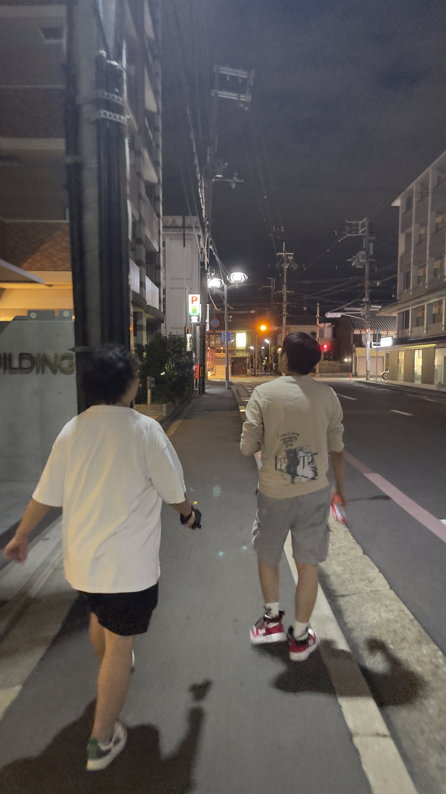
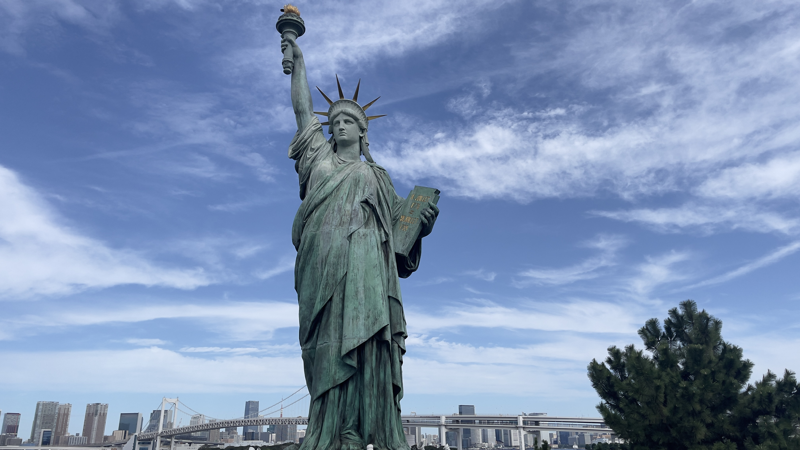
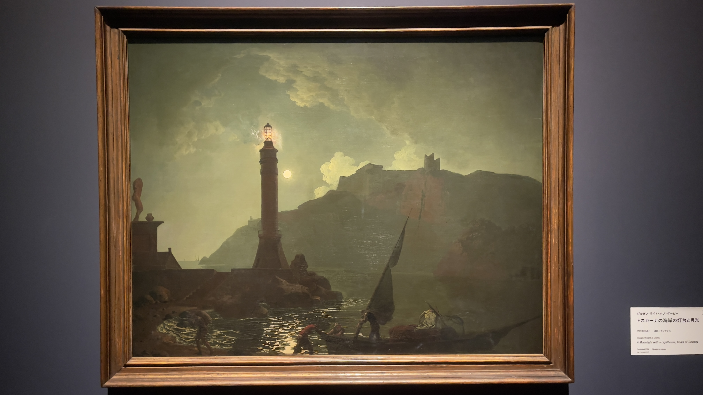
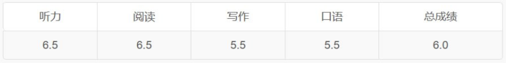

## Introduction

The last time I wrote an annual review was back in 2019. Six years have quietly passed since then, and life feels like a small boat drifting in the vast world.

In the past two years, I have experienced many "little miracles" in life—things I could never have imagined at the time, but now seem ordinary in retrospect. I am now in a relatively stable new phase. I am not writing this annual review to boast, but rather because I fear that, as time passes, I will forget (in fact, many feelings and memories have already faded). I also want to record these experiences so I can have the confidence to continue down the uncertain road ahead.

## 2023: Leaving My Job and Starting a New Life

2023 was a major turning point for me. I left the familiar environment of an internet company where I had worked for many years and decided to prepare for studying abroad. The work pressure and fast pace of life in China's internet industry had left me exhausted. I hoped that studying abroad would broaden my horizons, improve my abilities, and lay a solid foundation for a future career transition to MLE. Thus began my journey of "little miracles."

## "Little Miracle" 1: Driver's License

In the months after my resignation, I enrolled in a driving school to learn driving skills, knowing that living in the US without them would be very inconvenient.

I took the driving test very seriously, practicing every day. Before the written test, I completed all 2,000+ questions in the question bank. I repeatedly practiced every point for the second part of the test. I've always been afraid of failure, so I prepare as thoroughly as possible. The written test went smoothly and I passed on the first try. On the day of the second part, I was very nervous and talked to my instructor many times. The instructor reassured me, saying I was one of the better students and should just go for it. However, things didn't go as smoothly as I expected. After finishing the reverse parking and side parking, it suddenly started pouring rain as I was about to enter the S-curve. The water on the ground reflected the lines, making it hard to see, and I mistook a reflection for the edge of the road. Fortunately, I quickly realized and corrected my course. Thanks to my diligent practice, I managed to pass the second part. This taught me that preparation is never wasted—it's useful when it matters most.

The third and fourth parts were relatively easy, and I finally got my license in October.

This "little miracle" made me realize that difficulties aren't scary; what's important is how we face them.

## Interlude: Japan Trip

```
Trip dates: 9.20 - 10.4
Itinerary:
* 9.20 Kansai KIX (arrive 7pm on the 20th)
* 9.21 - 9.23 Kyoto (depart for Tokyo afternoon of the 23rd)
* 9.24 - 9.28 Tokyo (flight from Narita to Hokkaido on the 28th at 8pm)
* 9.29 - 10.4 Hokkaido
```

### Kyoto

During the driving test period, I also did other things. Before resigning, I got a Japanese visa, and in September 2023, I traveled to Japan with friends—my first trip after quitting. We arrived at Kansai Airport and then went to Kyoto. I instantly fell in love with the city: the ancient streets and buildings made me feel like I had traveled to another era, as if I were walking in an anime. Unlike most tourists who prefer Kiyomizu-dera, Kinkaku-ji, and Fushimi Inari Taisha, I was more attracted to the streets around Kyoto Imperial Palace, which had a strong nostalgic feel.


The alleys of Kyoto at night have a unique charm—dim lights, quiet streets, and the occasional passerby create a sense of tranquility. Some darker places were too scary for me to explore.



In short, my first impression of Kyoto was so strong that its food, culture, and nostalgic atmosphere made me want to return again and again. This planted the seed for my many future visits to Kyoto.

### Tokyo

We took the Shinkansen from Kyoto to Tokyo. The modernity and bustle of Tokyo contrasted sharply with Kyoto. My friend was actually in Tokyo for a conference, so we didn't visit many tourist spots. After Kyoto, Tokyo's modernity didn't excite me much—Shanghai and Tokyo aren't that different in this regard.


But I do have fond memories of sitting and daydreaming by the sea at Odaiba Seaside Park.



Another unforgettable experience was watching fireworks in Chofu City—words can't describe how beautiful it was.



At the National Art Center, I saw an exhibition themed "Light." Many works can only be appreciated in person; photos can't convey the sense of space and the play of light and shadow.



### Hokkaido

From Tokyo, we flew to Hokkaido. The natural scenery and tranquility of Hokkaido made me fall in love with the place, especially the views of Mount Asahi and Lake Akan.




## "Little Miracle" 2: IELTS Exam

After resigning, I faced another challenge: the IELTS exam. To apply for graduate programs in the US, I needed to meet a certain English proficiency, and IELTS was the standard.

I didn't pay attention in college English classes—mostly sleeping or skipping. The teacher always gave me just enough points to pass, but my English was basically abandoned. After years of working, I had forgotten almost everything. My first IELTS score was only 5.5, far from my target of 7.5.

I thought hard work would quickly solve the problem, but I underestimated the difficulty. Every 0.5-point increase from 5.5 to 7.5 was a struggle.

In total, I took the IELTS five times, going from 5.5 to 7.5.

The second time, after returning from Japan in October 2023, I got 6.0. Then I went home, bought my first used car, and wasted over two months slacking off until the Spring Festival. I thought being home would help me focus, but there were too many distractions, and self-discipline was hard.



I tried to adjust my mindset, so in March 2024, I went to Japan again with friends for inspiration. But after returning, my mother fell seriously ill and my aunt had surgery, so I spent two months caring for them. By then, the application season was over, so I had to aim for Fall 2025. The pressure was mounting—I felt like another year was slipping by. In May, I went to Hong Kong and Changsha to relax, then decided to get back on track.

From June to September, I finally had a relatively uninterrupted study period and scored 6.5 in September 2024. You might wonder why I couldn't just push through to 7.5. In reality, difficulties aren't like mountains—they're like ropes, wrapping around you one by one, making it hard to break free.


For example, after scoring 6.5 in September, I prepared for three more months, but before the December 15 exam, my father got sick and needed care for over a week. Still, I managed to improve to 7.0.


In January 2025, my brother needed care, and in February, I got sick myself. Finally, at the end of February, I stubbornly reached my target of 7.5.


My time was consumed by all sorts of things, mainly caring for family. There was little time or energy left for studying. I also had to fight my own procrastination, laziness, and even health issues. Often, I knew I should study, but just couldn't get motivated. Sometimes I wondered if I should have stayed in Shenzhen to study, since the pace and atmosphere there are better for work and study.

Looking back, these experiences taught me how to persist under pressure and find solutions in tough times. Ultimately, I achieved my goal of 7.5, qualifying for US graduate programs and gaining a deeper understanding of my own abilities.

## "Little Miracle" 3: Applying to US Graduate Programs

After reaching my IELTS goal, I started applying to US graduate programs. The process was full of challenges and uncertainties, but I learned how to plan and manage my time, and how to communicate and collaborate with others.

First, I spent a lot of time and effort writing personal statements and recommendation letters to showcase my abilities and potential. For school selection, I actually only applied to one: Northeastern University. I felt its Coop program fit my career goals, and its location near Seattle offered more internship and job opportunities. Another reason was affordability—other programs like CMU, BU, and USC were just too expensive for me. Even if I got in, I couldn't afford to attend.

I don't recommend this approach, as it's risky with no backup plan. I was lucky, and the acceptance rate was high this year, so I got in. Otherwise, I figured if I didn't get accepted, it was fate for me to keep working in China (bitter laugh).

## "Little Miracle" 4: F1 Visa

This was the last "little miracle" I experienced. After receiving my admission letter, I needed to apply for an F1 visa to enroll, which was also full of challenges and uncertainties.

There was a lot of news about student visas this year (Harvard barring foreign students, Northeastern University visa issues, appointment suspensions, increased social media scrutiny, etc.), much of it during my application period, especially for Chinese students. Many faced the risk of visa denial.

- [Trump administration bars Harvard from enrolling foreign students](https://apnews.com/article/harvard-trump-foreign-student-457d07268fba9c1f6f7f32fe0424bc3b)
- [Student Visas: US revokes 40 study visas of Northeastern university; records deleted without informing university or students](https://www.financialexpress.com/business/investing-abroad-us-revokes-40-student-visas-of-northeastern-university-legal-right-to-stay-in-america-removed-3802851/)
- [US State Department to End Pause on F-1 Student Visa Interviews Soon](https://www.visaverge.com/visa/us-state-department-to-end-pause-on-f-1-student-visa-interviews-soon/)

I was no exception. I spent a lot of time and effort preparing documents to prove my study plans and ties to China. Even so, I faced many questions in the interview, especially about my previous job at ByteDance and why I left a stable job for graduate school. The interviewer seemed dissatisfied and suspicious of my motives and abilities. In the end, I was given "administrative processing," which was discouraging and stressful. After waiting 72 days, I finally received my visa approval in July 2025 and could prepare for enrollment with relief.


## 2025: Looking Ahead

I arrived in Seattle on August 18 to start my graduate studies. No one picked me up, no one accompanied me—I was on my own. Although the journey was full of challenges and uncertainties, I believe these experiences have made me stronger and more confident. I look forward to overcoming more "little miracles" in my future studies and life, and achieving my dreams and goals.


Written on September 14, 2025, Seattle
