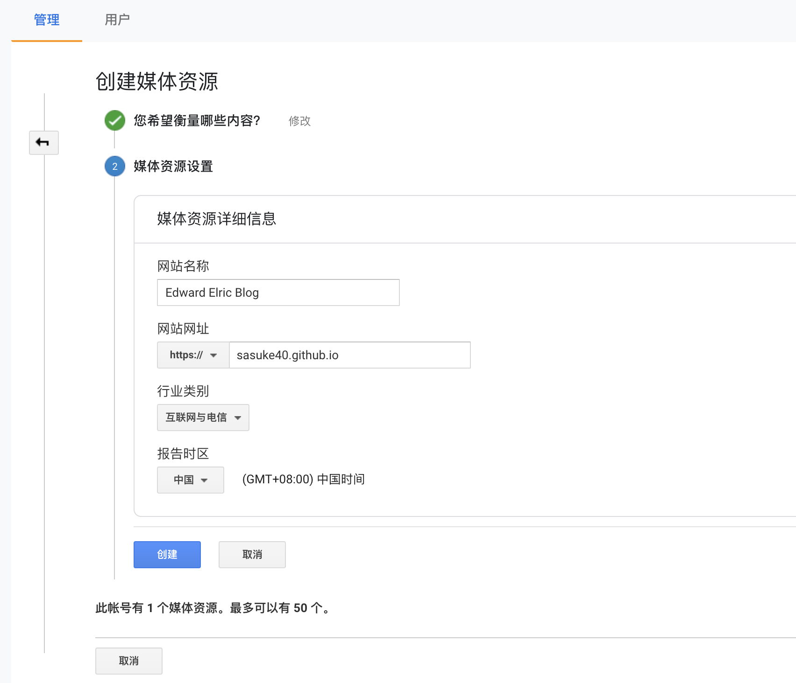
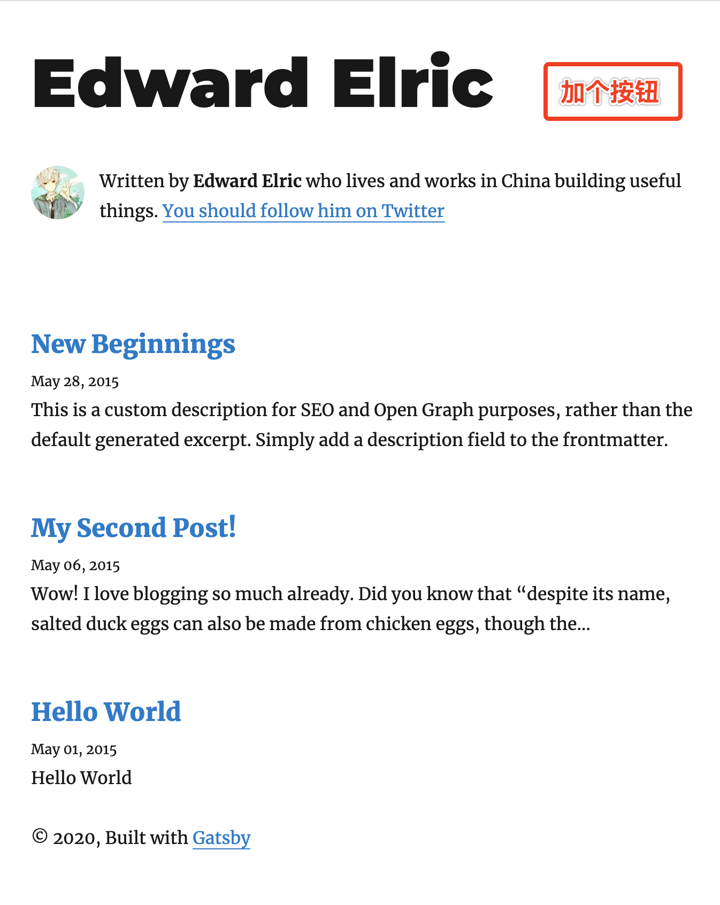
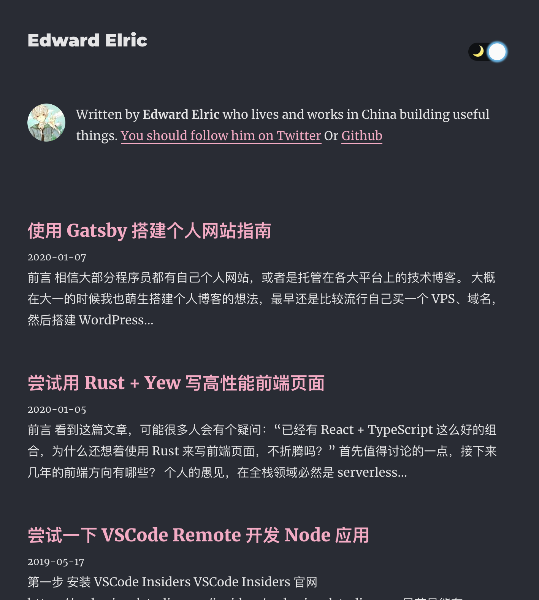
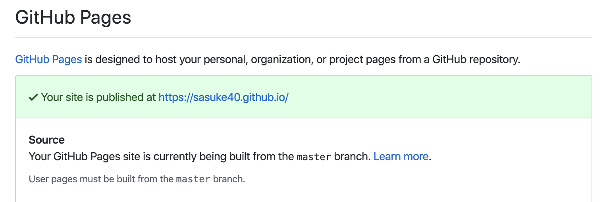

# 前言

相信大部分程序员都有自己个人网站，或者是托管在各大平台上的技术博客。

大概在大一的时候我也萌生搭建个人博客的想法，最早还是比较流行自己买一个 VPS、域名，然后搭建 **WordPress**。不过由于没续费，东西也没妥善备份也不知道去哪里了。
接着网络兴起**轻博客**，我想着自己塔多不方便，就用了**点点网**写自己的博客，在上面沉淀不少文章，然而点点网在 2016 年也关闭了。

自建和博客平台都不靠谱，我便转向了 **GitHub Pages**，正好那一阵流行用 `hexo` 生成静态博客站点，于是就搭建了一个放了些文章。其实放到现在来看主题还是挺好看的，不过由于我没有备份的良好习惯，有几篇文章的 md 文件被我弄丢了。

因此，这次我把整个站点备份了一下（学乖了），并在上面盖新的个人网站。因为比较熟悉 React 的缘故，这次用的是 `Gatsby` 进行搭建。

# 准备工作

1. 安装 Gatsby CLI

```shell
npm install -g gatsby-cli
```

2. 创建项目

```shell
gatsby new
```

目录结构如下：

```
.
├── LICENSE
├── README.md
├── content
├── gatsby-browser.js
├── gatsby-config.js
├── gatsby-node.js
├── node_modules
├── package-lock.json
├── package.json
├── src
└── static
```

3. 本地开发

```shell
gatsby develop
```

4. 常用的插件

```json
"gatsby-plugin-feed": "^2.3.25",
"gatsby-plugin-google-analytics": "^2.1.31",
"gatsby-plugin-manifest": "^2.2.34",
"gatsby-plugin-offline": "^3.0.30",
"gatsby-plugin-react-helmet": "^3.1.18",
"gatsby-plugin-sharp": "^2.3.10",
"gatsby-plugin-typography": "^2.3.20",
"gatsby-remark-copy-linked-files": "^2.1.33",
"gatsby-remark-images": "^3.1.39",
"gatsby-remark-prismjs": "^3.3.28",
"gatsby-remark-responsive-iframe": "^2.2.30",
"gatsby-remark-smartypants": "^2.1.19",
"gatsby-source-filesystem": "^2.1.43",
"gatsby-transformer-remark": "^2.6.45",
"gatsby-transformer-sharp": "^2.3.9",
```

# 配置及开发

## 配置

首先最重要的就是 `gatsby-config.js` 文件了，我们需要在里面启用上述安装的插件，配置可以到 [sasuke40.githu.io](https://github.com/SASUKE40/sasuke40.github.io) 查看。

还有得去 [google analytics](https://analytics.google.com/) 配置一下记录站点的访问信息。

配置结束会给你个跟踪 ID，在配置文件 `gatsby-plugin-google-analytics` 下修改就行。

## 开发 Dark Mode

其实上面配置完成基本上站点就能用了，不过 Gatsby 最好玩的是他的灵活。自带的没有夜间模式，下面我快速介绍一下怎么开发。



1. 注入全局函数
   在 src 目录下新建 `html.js`，开发一个用于控制主题的全局函数

```jsx
<script
  dangerouslySetInnerHTML={{
    __html: `
    (function() {
      window.__onThemeChange = function() {};
      function setTheme(newTheme) {
        window.__theme = newTheme;
        preferredTheme = newTheme;
        document.body.className = newTheme;
        window.__onThemeChange(newTheme);
      }

      var preferredTheme;
      try {
        preferredTheme = localStorage.getItem('theme');
      } catch (err) { }

      window.__setPreferredTheme = function(newTheme) {
        setTheme(newTheme);
        try {
          localStorage.setItem('theme', newTheme);
        } catch (err) {}
      }

      var darkQuery = window.matchMedia('(prefers-color-scheme: dark)');
      darkQuery.addListener(function(e) {
        window.__setPreferredTheme(e.matches ? 'dark' : 'light')
      });

      setTheme(preferredTheme || (darkQuery.matches ? 'dark' : 'light'));
    })();
  `
  }}
/>
```

2. 开发 Toggle 组件

准备好两张 Icon 图片，然后把 [react-toggle](https://github.com/aaronshaf/react-toggle/) 魔改一下就行。

3. 修改 layout

```jsx
{
  theme != null ? (
    <Toggle
      icons={{
        checked: (
          
        ),
        unchecked: (
          
        )
      }}
      checked={theme === 'dark'}
      onChange={e =>
        window.__setPreferredTheme(e.target.checked ? 'dark' : 'light')
      }
    />
  ) : (
    <div style={{ height: '24px' }} />
  )
}
```

4. 编写全局样式
   编写 `global.css` 并在 `typography.js` 导入它，主要工作是给 body 配置 css 变量

```css
body {
  --pink: rgb(255, 167, 196);
  background-color: var(--bg);
}

body.light {
  --bg: #ffffff;
  --bg-secondary: rgb(249, 250, 251);
  --header: var(--pink);
  --textNormal: #222;
  --textTitle: #222;
  --textLink: #d23669;
  --hr: hsla(0, 0%, 0%, 0.2);
  --inlineCode-bg: rgba(255, 229, 100, 0.2);
  --inlineCode-text: #1a1a1a;
  --form-shadow: 0 2px 15px 0 rgba(210, 214, 220, 0.5);
}

body.dark {
  -webkit-font-smoothing: antialiased;

  --bg: #282c35;
  --bg-secondary: rgb(54, 60, 72);
  --header: #ffffff;
  --textNormal: rgba(255, 255, 255, 0.88);
  --textTitle: #ffffff;
  --textLink: var(--pink);
  --hr: hsla(0, 0%, 100%, 0.2);
  --inlineCode-bg: rgba(115, 124, 153, 0.2);
  --inlineCode-text: #ffee93;
  --form-shadow: 0 2px 15px 0 rgba(26, 26, 27, 0.637);
}
```

最终效果就是这样


# 部署

1. 安装 gh-pages

```shell
npm install gh-pages --save-dev
```

2. 配置部署脚本

```json
{
  "scripts": {
    "deploy": "gatsby build && gh-pages -d public -b master"
  }
}
```

3. 推送源码到 dev 分支

Github Pages 有个特殊的规则，就是 \<username\>.github.io 会默认使用 `master` 分支中的生产代码。这也就是为什么 `gh-pages -d public -b master` 中是指定 `master`，而不是 `gh-pages`。

因此，源码就需要放到非 `master` 分支上。我把博客的源码推到 `dev` 分支，并将其设置为默认。


4. 推送构建后的生产代码

```shell
npm run deploy
```

推送后应该稍微等一下，就可以访问个人网站了。

# 总结

Gastby 优势

- 相当的灵活，给个人网站巨大的修改空间
- 支持 graphql，数据调用方便
- 生态强大，1500+ 数量的插件基本满足大部分需求

Gastby 劣势

- 因其灵活，对个人博客的友好度就没那么高，md 文件及文件夹需要自己建立。不像 hexo 可以 `hexo new [layout] <title>` 这么方便

总体来说，我对 Gatsby 还挺满意的。要是大家挖掘到好玩的插件、好看的主题也欢迎留言。
最后，也欢迎大家互换友链 ➡️[Edward Elric](https://sasuke40.github.io/)
