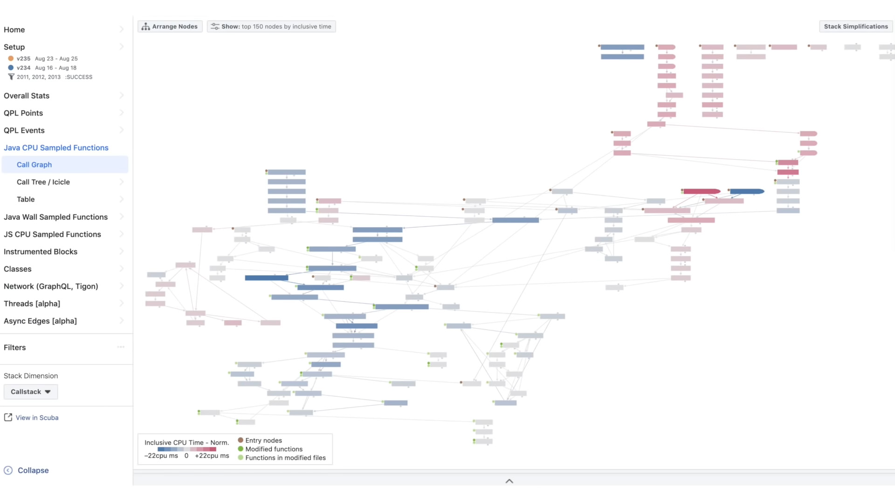
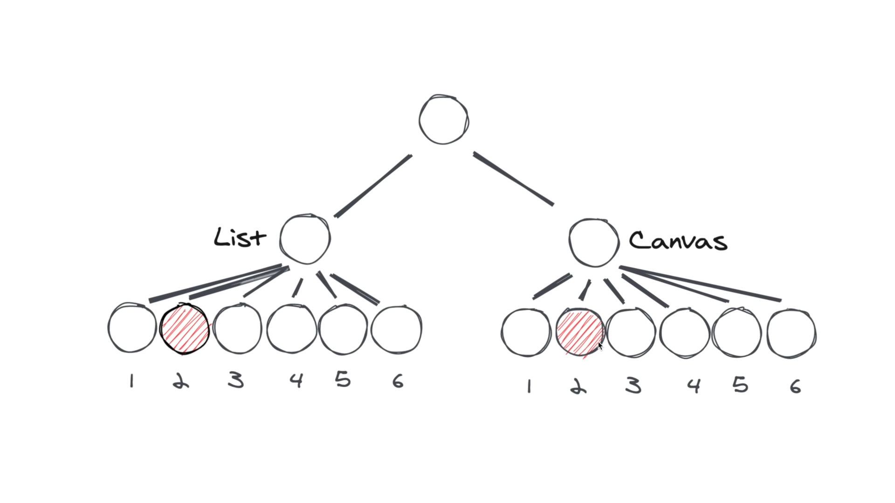
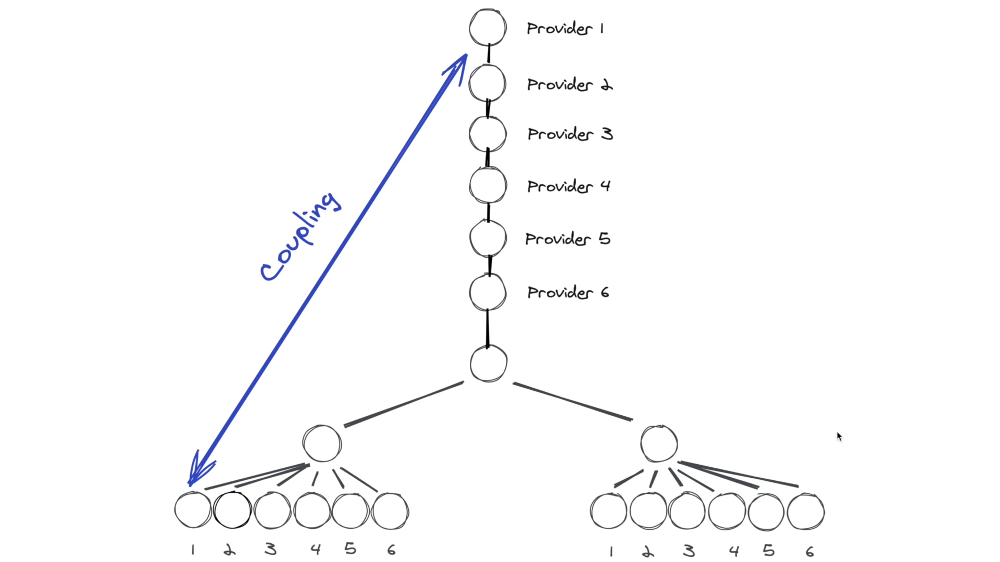
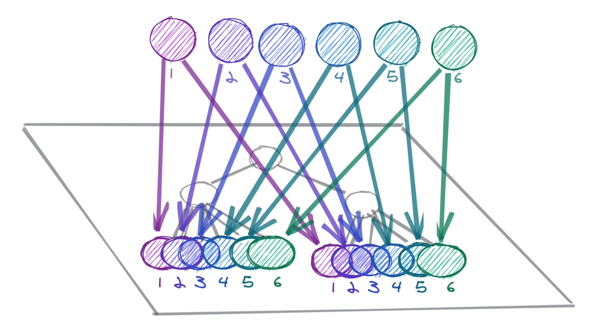
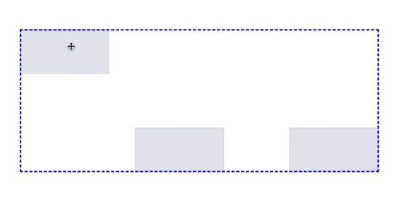
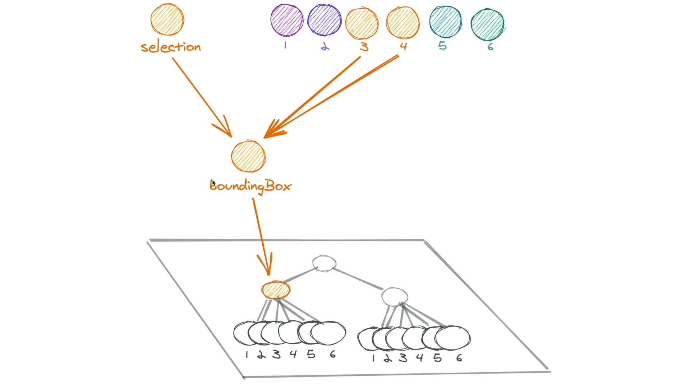

# 前言

最近在 React Europe 2020 Conference 上， facebook 内部释出一个状态管理库 [Recoil](https://recoiljs.org/)

通过官方的宣传以及初步的使用，Recoil 在处理 shared state 上比较方便，也能做到最小度的更新来提升复杂 App 的性能。不过有趣的是，对 Recoil 的 `atom` `selector` 这些 API 设计而言，其实就是早在 47 年提出的 **Actor Model**，可谓是前端状态管理的文艺复兴。

# Actor Model 部分

## 什么是 Actor Model

Actor 模型(Actor model)首先是由 Carl Hewitt 在 1973 定义， 由 Erlang OTP(Open Telecom Platform) 推广，其消息传递更加符合面向对象的原始意图。Actors 属于并发组件模型，通过组件方式定义并发编程范式的高级阶段，避免使用者直接接触多线程并发或线程池等基础概念。

流行语言并发是基于多线程之间的共享内存，使用同步方法防止写争夺，Actors 使用消息模型，每个 Actors 在同一时间处理最多一个消息，可以发送消息给其他 Actors，保证了单独写原则。从而巧妙避免了多线程写争夺。

Actor Model 主要有几个特点：

- 轻量：Actor 是系统内的一个基础单位，每个 Actor 只负责自己的工作
- 没有 Shared State：每个 Actor 各自管理自己的 state，跑在各自的 thread 上，不共享内存和 state
- 通过消息传递：每个 Actor 有一个消息队列，类似 MailBox / Queue，接受到的消息会在此队列等待依次执行

[^https://en.wikipedia.org/wiki/actor_model]: Wikipedia Actor model
[^http://jiangew.me/actor-model/#what-actor-model]: Actor 编程模型浅谈

## 谁使用 Actor Model

- Erlang
- Akka
- Vert.x
- Actix
- ...

# Recoil 部分

## Recoil 产生背景

前端的应用越来越复杂，诸如常见的 Web 监控面板，包含各类的性能数据、节点信息、分类聚合用来进行应用分析。可以想象得到面板中包含各类的交互行为，编辑、删除、添加、将一个数据源绑定多个面板等等。除此之外，还需要对数据持久化，这样就能把 url 分享给其他人，并要确保被分享的人看到的是一致的。

因此开发过程中要尽量做到页面最小化更新达到高性能的目的，需要对数据流的操作更加精细。



面对这样的挑战，一般会想到用一些状态管理的函数或者库，如 React 内置的 state 管理，或者 Redux。

Recoil 想通过一个不一样的方式来解决这些问题，主要分为 3 个方面：

- Flexible shared state: 在 react tree 任意的地方都能灵活共享 state，并保持高性能
- Derived data and queries: 高效可靠地根据变化的 state 进行计算
- App-wide state observation: time travel debugging, 支持 undo, 日志持久化

##Recoil 主要设计

### Shared state

有一个应用基于这样一个场景，将 List 中更新一个节点，然后对应 Canvas 中的节点也更新



#### 第 1 种方式

把 state 传到公共的父节点转发给 canvas 子节点，这样显然会全量 re-render

#### 第 2 种方式

给父节点加 Provider 在子节点加 Consumer，不过每多加一个 item 就要多一层 Provider



#### 第 3 种方式

在 react tree 上创建另一个正交的 tree，把每片 item 的 state 抽出来。每个 component 都有对应单独的一片 state，当数据更新的时候对应的组件也会更新。Recoil 把 这每一片的数据称为 Atom，Atom 是可订阅可变的 state 单元。



配合 `useRecoilState` 可以使用这些 Atom，实践上对多个 item 的 Atom 可以用 memorize 进行优化，具体可以在官方文档查看，这里不赘述。

[^https://recoiljs.org/docs/api-reference/core/atom]: Recoil Atom

### Derived Data

有这么一个场景需要根据多个 Item Box 计算 Bounding Box



如果你是 Vue 的爱好者，你可能想到了计算属性。Derived Data 确实有 computed props 的味道，具体思路是选取多个 Atom 进行计算，然后返回一个新的 state。因此在 Recoil 中设计了 `select` 这样的 API 来选取多个 Atom 进行计算。



`select` 的设计和 Proxy 挺像的，属性上有 `get` 进行读取，有 `set` 进行设置，函数内部又有 `get`， `set` 操作 state

```js
import { atom, selector, useRecoilState } from 'recoil'

const tempFahrenheit = atom({
  key: 'tempFahrenheit',
  default: 32
})

const tempCelcius = selector({
  key: 'tempCelcius',
  get: ({ get }) => ((get(tempFahrenheit) - 32) * 5) / 9,
  set: ({ set }, newValue) => set(tempFahrenheit, (newValue * 9) / 5 + 32)
})
```

### App-wide observation

这个场景下需要把 url 分享给其他人，别人打开相同的链接也能看到一样的页面。

那么就需要 observe Atom 的变更，Recoil 使用 `useTransactionObservation` 进行订阅

```js
useTransactionObservation(({atomValues,modifiedAtoms,...} => {}))
```

另一方面，打开链接的时候也需要对输入的数据进行校验

```js
const counter = atom({
  key: 'myCounter',
  default: 0,
  validator: (untrustedInput),
  metadata: ...
})
```

##Recoil 后续

目前 Recoil 还属于实验阶段，不过能确定的是 Recoil 会兼容 React Concurrent Mode

# Actor Model & Recoil 联系

通过前面提及 Recoil 的设计，可以发现两者的理念是相似的。

在实现的细节中 Recoil 维护了新的队列，并通过订阅、派发的机制完成消息的传递及组件的更新。

```js
// Fire or enqueue callbacks to rerender components that are subscribed to
// nodes affected by the updatedNodes
function fireNodeSubscriptions(
  store: Store,
  updatedNodes: $ReadOnlySet<NodeKey>,
  when: 'enqueue' | 'now'
) {
  /*
  This is called in two conditions: When an atom is set (with 'enqueue') and
  when an async selector resolves (with 'now'). When an atom is set, we want
  to use the latest dependencies that may have become dependencies due to
  earlier changes in a batch. But if an async selector happens to resolve during
  a batch, it should use the currently rendered output, and then the end of the
  batch will trigger any further subscriptions due to new deps in the new state.
  */
  const state =
    when === 'enqueue'
      ? store.getState().nextTree ?? store.getState().currentTree
      : store.getState().currentTree

  const dependentNodes = getDownstreamNodes(state, updatedNodes)

  for (const key of dependentNodes) {
    ;(state.nodeToComponentSubscriptions.get(key) ?? []).forEach(
      ([debugName, cb]) => {
        when === 'enqueue'
          ? store.getState().queuedComponentCallbacks.push(cb)
          : cb(state)
      }
    )
  }

  // Wake all suspended components so the right one(s) can try to re-render.
  // We need to wake up components not just when some asynchronous selector
  // resolved (when === 'now'), but also when changing synchronous values because
  // they may cause a selector to change from asynchronous to synchronous, in
  // which case there would be no follow-up asynchronous resolution to wake us up.
  // TODO OPTIMIZATION Only wake up related downstream components
  Tracing.trace(
    'value became available, waking components',
    Array.from(updatedNodes).join(', '),
    () => {
      const resolvers = store.getState().suspendedComponentResolvers
      resolvers.forEach(r => r())
      resolvers.clear()
    }
  )
}
```

其实 Recoil 不是 Actor Model 在前端的首次实践，2 年前 PolymerLabs 就有 [actor-helpers](https://github.com/PolymerLabs/actor-helpers) 以及 [actor-boilerplate](https://github.com/PolymerLabs/actor-boilerplate) 相关的实践。不过在 React 强大的生态以及 React Hooks 的加持之下，用 Sync 的方式做到异步 state 管理和共享，同时保持交互流程、高性能的 Recoil 算是补充了一个不错的方案。

[^https://blog.techbridge.cc/2019/06/21/actor-model-in-web/]: 46 年老技術與 Web 的新火花 - Actor Model in Web

# 补充

Recoil 刚刚释出实验版本，我想正好可以在不断更改的过程中了解前端 Actor Model 的实现方式步骤。

另外，其实不少人批评前端的发展就是到处借鉴，没有新的事物，像是 WPF 就有很多前端可以借鉴的地方（确实也如此）。

不过在我看来，放到一个比较长的时期里，前端慢慢吸收各类后端、客户端的设计思想才产生“新”事物是很正常的发展进程。包括经常被提到的 Vue 和 React 孰优孰劣之争，Node.js 不堪大用等等话题，其实都是历史发展及其技术定位所致。可能对其他领域的看来是不新鲜，但对前端而言是语言发展（残疾而缝合的 JavaScript）、生态繁荣才有可能繁衍出这些对前端而言的新事物。
