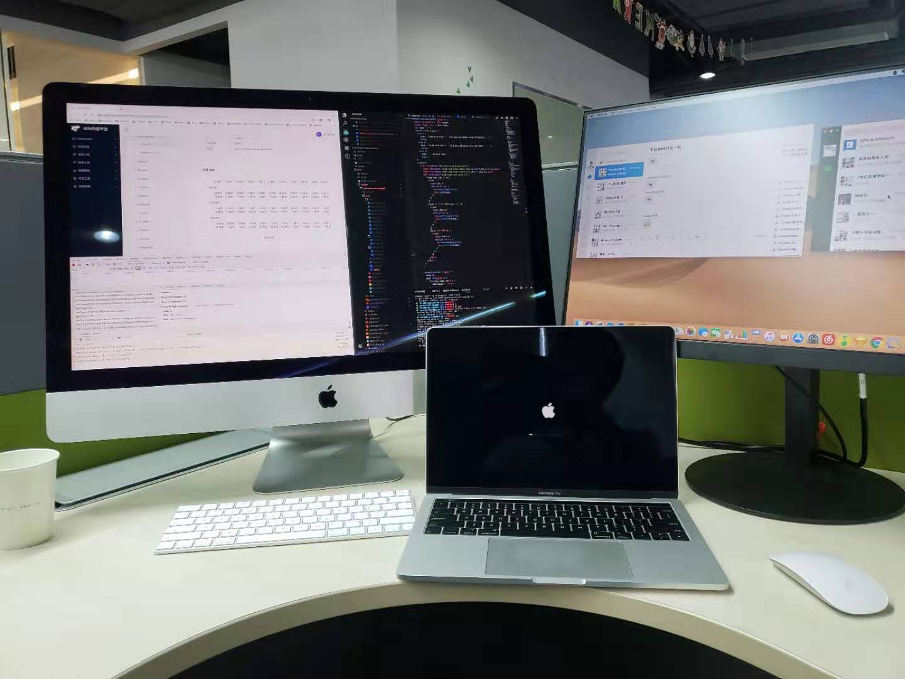
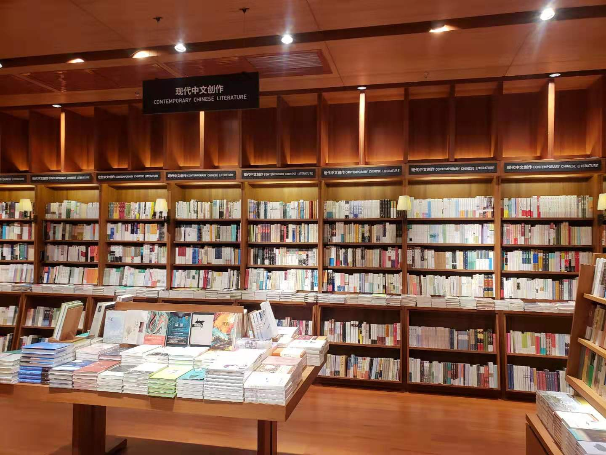

> 自我推翻自我重建，我觉得是活着的人该做的事情。
>
> 一个人要是对这个世界失去好奇心，失去求知欲，这个人已经是死的了。
>
> —— 摘自 Zeke

2019 年，我从杭州阿里来到深圳腾讯工作的一年，这一年充满了感恩、迷茫、思考、转变。

# 生活

在朋友的帮助下，我顺利的在深圳安顿下来，很感谢他。

年头的时候去广州参加同学的婚礼，感觉时间过得好快。

然后还和经常一起玩吃鸡、CSGO、彩六的网友见了一面，一起吃饭、玩耍。不过后面大家还是天南地北，很多回去学校了，真希望有缘能再聚一次。

国庆的时候和家人一起去澳门玩，看了大三巴牌坊。

在珠海长隆海洋王国看动物，大家都很喜欢海豹呢。

其实我不是个喜欢和家人打电话的人，但内心家人对我来说非常的重要。同时我也感恩有一个智慧的妈妈，她爱阅读、爱思考，教会我如何待人接物、为人处事。

我也努力沉下心来也读了一些书，如： 《旧制度与大革命》《1984》《学会提问：批判性思维指南》等等，渐渐也能收获阅读的乐趣。

# 看过的频道

1. 妈咪说 Mommy Talk

   在 B 站上看，主要是科普天文、数学、物理之类的，最近讲混沌非常有意思。

2. 3Blue1Brown

   Youtube 上看的，Grant Sanderson 从独特的视觉角度解说高等数学，也非常擅长开发，用可视化来让人快速理解数学之美。

3. NiceChord

   讲乐理之类的，不过 Wiwi 官大为好像是个技术宅，也经常会放一些音乐编程的视频。

# 看过的电视剧

- 《致命女人》：好看
- 《权力的游戏》：烂尾
- 《Years and Years》：噱头比较大
- 《切尔诺贝利》
- 《性爱自修室》

# 看过的番剧

- 《进击的巨人 第三季》：强烈推荐
- 《约定的梦幻岛》
- 《流汗吧！健身少女》
- 《Dr. STONE 石纪元》
- 《刀剑神域 Alicization 篇》

# 技能

- 健身 💪

  坚持了几个月，和同事一起去的，但后来健身房改造就没去（其实也是懒惰的理由）

- 钢琴 🎹

  其实有点荒废这个天赋，希望 2020 能坚持下来

- 煮饭 🍳

  买了一套厨具，不过没怎么用，果然还是不喜欢烧菜

# 参与分享

6 月的时候，参加 GIAC 作为讲师分享

# 思考

其实过去的一年我生活在恐慌之中，我发现个人的成长几乎停滞不前。

我开始反思自己为什么会这样？

然后我发现了其实我是用工作麻痹自己，不肯直面 2018 的过去，失去了对自己对未来的信心。其实这并不能完全归咎于自己，不过沉迷不悟始终不是办法。

这里要感谢 Zeke，在和他聊天过程中我找到了方向：我需要的是自我推翻自我重建，保持求知欲、好奇心。

# 展望

2020 年我开始摈弃麻痹，不管多困难都要离开舒适圈。

也给自己定下了一个目标：「让自己成为有影响力的人」
